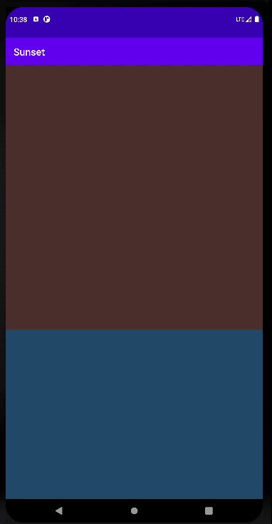

Sunset
======
本章讲的就是属性动画，介绍了`ObjectAnimator`使用，包括两个控制动画变化规律的对象

1. `TimeInterpolator`主导动画的运动速率
2. `TypeEvaluator<T>`翻译过来叫评估器，让动画能够以一种合理的趋势进行变化,就像`ArgbEvalutor`使得在执行颜色动画时能够很自然地完成色彩过渡

贴张真图，那天拍完这张图在回去途中在马路中间看到了很漂亮的日落,可惜过了马路后路边有树木遮挡就看不到了

 
效果图
------
* 这里用 `ValueAnimator `设置sunView的缩放值，并指定了重复次数为无限
* `AnimatorSet` 加了动画完成监听事件来判断是执行日落还是日升

   

几个要点  
--------
1.View的绘制顺序是按照其在布局文件中定义的顺序被绘制出来，就像FrameLayout那样。举个例子:

如下所示,因为sky在布局文件中比sea早定义，意味着如果对sea执行向上平移时，会遮挡住sky,在它上面移动；反过来对sky进行向下平移时,sky中穿行"

    <LinearLayout xmlns:android="http://schemas.android.com/apk/res/android"
        xmlns:tools="http://schemas.android.com/tools"
        android:id="@+id/scene"
        android:layout_width="match_parent"
        android:layout_height="match_parent"
        android:orientation="vertical">
    
        <FrameLayout
            android:id="@+id/sky"
            android:layout_width="match_parent"
            android:layout_height="0dp"
            android:layout_weight="0.61"
            android:background="@color/blue_sky"/>
      
        <View
            android:id="@+id/sea"
            android:layout_width="match_parent"
            android:layout_height="0dp"
             android:alpha="0.5"
            android:layout_weight="0.39"
            android:background="@color/sea" />
    
    </LinearLayout>

2.View中的top、bottom、left、right属性指的是相对于它在父布局的坐标。相比之下 `MotionEvent` 的getRawX()和getRawY()直接返回在屏幕中的坐标

3.在创建 `ObjectAnimator` 需要传入属性也就是类的字段，该属性必须要有get和set方法，因为内部是通过反射机制来调用set方法来修改对象的属性值

小结
---
属性动画通过实实在在地改变View的属性来呈现动画效果。比较不方便的一点是需要等View从布局加载完成后才能开始处理
(比如在获取sunViwe的top时,这个值并非马上就有的，需要等待布局文件绘制的完成)。另外再引用书上的一句话:

>属性动画框架并不擅长处理待显示布局的屏幕动画

除了像属性动画，还有像帧动画、补间动画(和转场动画有没有关系呢?)。还有就是 `MotionLayout`(很酷)

